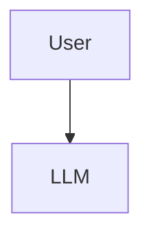

# Diagrams

This folder contains **Mermaid source files** (`.mmd`) for all architecture diagrams used in the hub.

## How to Use

### Option 1 — Render inline in GitHub
Mermaid is natively supported by GitHub. Just include in any markdown:

```markdown

```

### Option 2 — Render locally
```bash
# Install Mermaid CLI
npm install -g @mermaid-js/mermaid-cli

# Render
mmdc -i transformer-block.mmd -o transformer-block.png
```

### Option 3 — View in VS Code
Install the **Markdown Preview Mermaid Support** extension.

---

## Diagram Index

| Diagram | Source | Used in |
|---|---|---|
| Transformer block | [transformer-block.mmd](transformer-block.mmd) | docs/01-architecture |
| Serving stack | [serving-stack.mmd](serving-stack.mmd) | docs/02-attention-serving |
| RLHF pipeline | [rlhf-pipeline.mmd](rlhf-pipeline.mmd) | docs/06-alignment-rlhf |
| Model landscape | [model-landscape.mmd](model-landscape.mmd) | docs/01-architecture |

> Note: RAG / Agent / AWS / Security / E2E diagrams (sections 7-12) were moved to an external production repo. The .mmd source files for those sections remain in this folder for now but are not referenced from the active docs.

---

## How to Add a New Diagram

1. Create `your-diagram.mmd` here
2. Add an entry to the table above
3. Reference it in the relevant `docs/` section with a markdown image link

```markdown

```